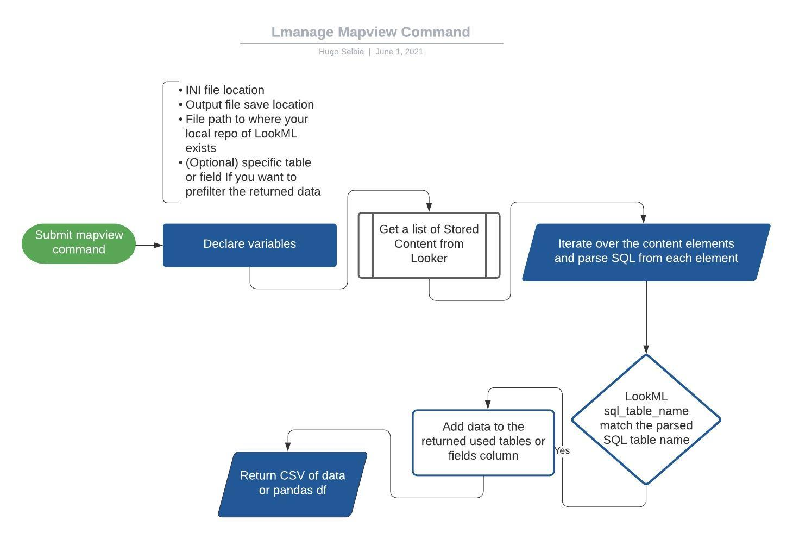

# Lmanage
## What is it.
LManage is a collection of useful tools for [Looker](https://looker.com/) admins to help curate and cleanup content and it's associated source [LookML](https://docs.looker.com/data-modeling/learning-lookml/what-is-lookml).

## How do i Install it.
Lmanage can be found on [pypi](#).
```
pip install lmanage
```

## How do I Use it.
### Commands
LManage will ultimately will have many different commands as development continues 
| Status  | Command    | Rationale                                                                                                                                                                                            |
|---------|------------|------------------------------------------------------------------------------------------------------------------------------------------------------------------------------------------------------|
| Live    | mapview    | Find the LookML fields and tables that are associated with a piece of Looker content                                                                                                                 |
| Planned | removeuser | Based on last time logged in, prune Looker users to ensure a performant, compliant Looker instance                                                                                                   |
| Planned | dcontent   | Iterate through an input of content, delete content and back it up using [gzr](https://github.com/looker-open-source/gzr) for easy restoration                                                                                               |
| Planned | bcontent   | Iterate through all broken content (using content validator) and email a customized message to each dashboard owner                                                                                  |
| Planned | scoper     | Takes in a model file, elminates the * includes, iterate through the explores and joins and creates a fully scoped model include list for validation performance and best practice code organization |

#### help and version
```
lmanage --help
Usage: lmanage [OPTIONS] COMMAND [ARGS]...

Options:
  --version  Show the version and exit.
  --help     Show this message and exit.

Commands:
  mapview
```
#### mapview
The mapview command will find the etymology of the content on your dashboard, exporting a CSV that looks like [this](https://docs.google.com/spreadsheets/d/1TzeJW46ml0uzO9RdLOOLxwtvUWjhmZxoa-xq4pbznV0/edit?resourcekey=0-xbWC87hXYFNgy1As06NncA#gid=900312158).

##### example usage
`lmanage mapview --path ./output/my_output.csv --ini-file ~/py/projects/ini/k8.ini --project /test_lookml_files/the_look -table "order_items"`
##### flags
- **path** (`--path`, `-fp`) This is the path where you would like the outputfile for your returned dataset to be. 
- **ini-file** (`--ini-file`, `-i`) This is the file path to the ini file that you've created to use the Looker SDK
```
#example Ini file
[Looker_Instance]
base_url=https://looker-dev.company.com:19999 (or 443 if hosted in GCP)
client_id=abc
client_secret=xyz
verify_ssl=True
```
- **project** (`--project`, `-p`) This is the file path to your local project of LookML files that lmanage will scan to associate connections between your Looker content and LookML
Lmanage can either return a full dataset of all content mapping, or a prefiltered dataset with all content associated with a specific table or field.
- **table** (`--table`, `-t`) **Optional** Expecting input of lookml view name
- **field** (`--field`, `-f`) **Optional** Expecting input of fully scoped LookML field name e.g. viewname.fieldname 





## Fields Returneds

- **dashboard_id**: the id of the looker dashboard 	
- **element_id**: the id of the visualization element on the looker dashboard	
- **sql_joins**: the joins used in a query grouped by element id	
- **fields_used**: the fields used by the query grouped by element id
- **sql_table_name**: the underlying sql value being referenced at the view level of the lookml (assuming the view is standard)	
- **lookml_file_name**: the physical file in which the view files reside
- **potential_join**: for the explore that powers the element query: what are all the potential joins available	
- **used_joins**: joins used by the underlying queries obtained by parsing sql of query 	
- **used_view_names**: views that are used by each query grouped by element_id	
- **unused_joins**: views that are unused by the specific query of the dashboard element

##### n.b.
**Multi Project Usage**
Dashboards can hold tiles from multiple projects, in this case if you create one local folder of lookml see example below, then pass the value of that one meta folder the the `--project` flag. Doing this will enable the underlying LookML parsing engine driven by [pyLookML](https://github.com/llooker/pylookml) to iterate over all the relevant files and find the appropriate cross project matches.

```
├── test_lookml_files
    │    ├── dashboards
    │    │   ├── brand_lookup.dashboard.lookml
    │    │   ├── business_pulse.dashboard.lookml
    │    │   ├── customer_lookup.dashboard.lookml
    │    ├── models_proj1
    │    │   └── thelook.model.lkml
    │    ├── models_proj2
    │    │   └── thelook_redshift.model.lkml
    │    ├── view_proj1
    │    │   ├── 01_order_items.view.lkml
    │    │   ├── 02_users.view.lkml
    │    │   ├── 03_inventory_items.view.lkml
    │    │   ├── 04_products.view.lkml
    │    │   ├── 05_distribution_centers.view.lkml
    │    └── view_proj2
    │        ├── 01_order_items.view.lkml
    │        ├── 02_users.view.lkml
    │        ├── 03_inventory_items.view.lkml
    │        ├── 04_products.view.lkml
    │        ├── 05_distribution_centers.view.lkml
    │        ├── 11_order_facts.view.lkml
    │        ├── 12_user_order_facts.view.lkml
    │        ├── 13_repeat_purchase_facts.view.lkml
    │        ├── 22_affinity.view.lkml
    │        ├── 25_trailing_sales_snapshot.view.lkml
    │        ├── 51_events.view.lkml
    │        ├── explores.lkml
    │        └── test_ndt.view.lkml.
```


**This is not an officially supported Google Product.**
